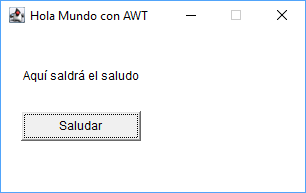
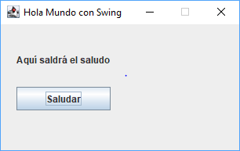
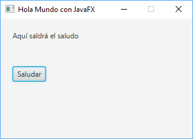

# HolaGUI

Comparativa de tres frameworks Java para desarrollar interfaces gráficas de usuario (GUI): AWT, Swing y JavaFX. Implementación de la misma aplicación en cada uno de los frameworks.

## AWT



## Swing 



## JavaFX



## Ejecución

Descargar el código fuente y entrar en el directorio proyecto:

```bash
git clone https://github.com/dam-dad/HolaGUI.git
cd HolaGUI
```

Construir el proyecto y crear un JAR ejecutable en el directorio `target`:

```bash
mvn package
```

Ejecutar la aplicación:

```bash
mvn exec:java
```
